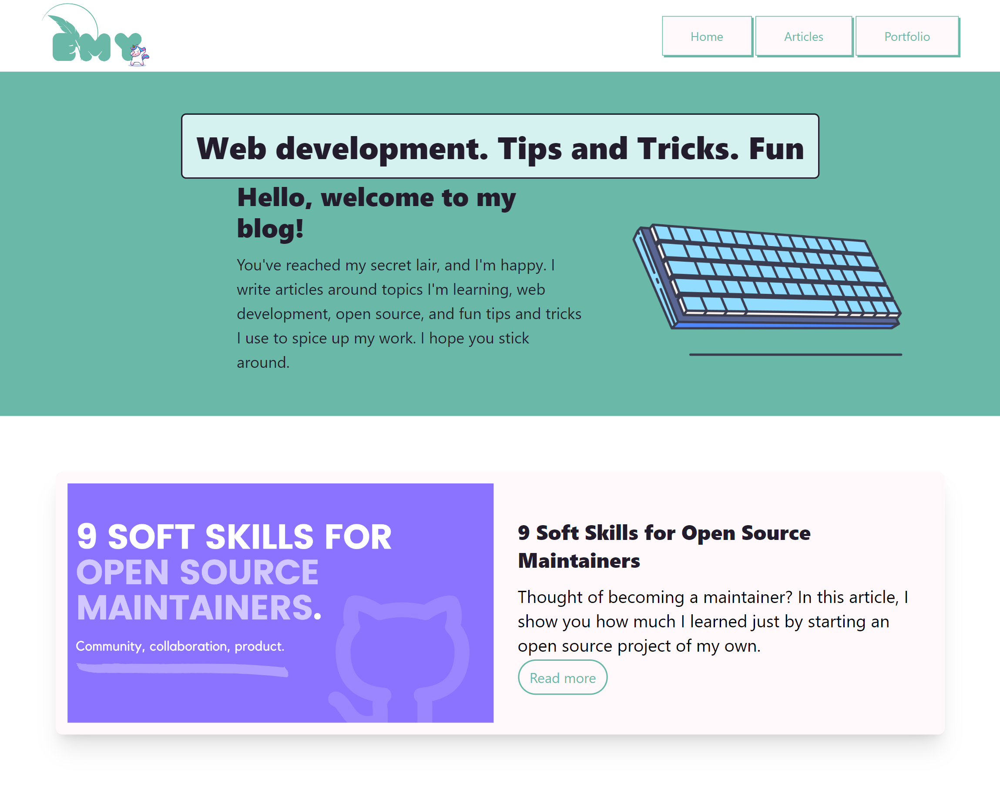

# 🔥My Blog is here!

After months of digging and toiling with astro, my blog is finally ready! I had a lot of fun building this one, and I'm sure I'll have just as much fun updating it with my articles (that is if i don't procrastinate till i dai ohoho)

# ⚒️ Tech Stack
This site is built with;
- Astro
- TailwindCSS

Nothing too big. To run this on your local machine;
- Fork the repo
- Clone 
- Open the project's directory in your terminal and run `npm install` to install all dependencies
- `npm run dev` to get it up and running on a local server

# 👯To Contributors
As of now, this project is not open to contributions, but if you spot something out of place, please open an issue. 

> ⚠️ DO. NOT. COPY. This is not a template.